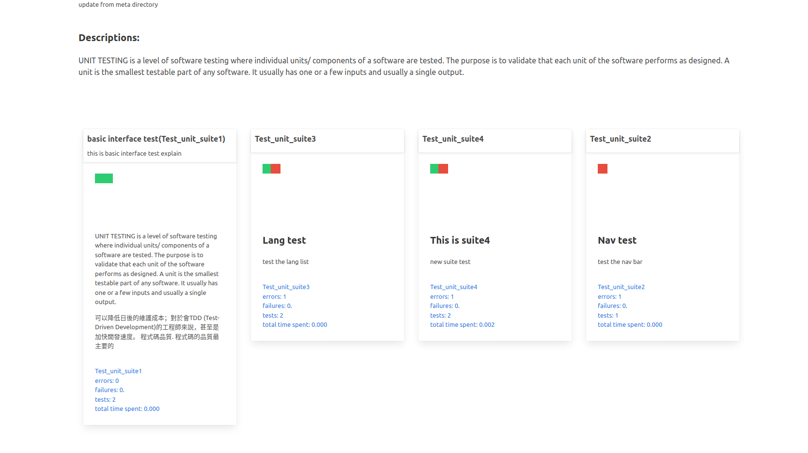

# gatsby-test-result-page



## Background

this is a page powered by gatsby to present the test result by python's xmlrunner

## To run
```bash
# 1. run the tests (python part)
# python execute the tests -> xml generated -> post process to convert into json
$ cd unittest-json-reporting-tryout
$ ./run.sh

# 2. optional, to sync the results json to the gatsby src/content directory
$ cd ../../gatsby-test-result-page
$ ./regen_test_result.sh

# 3. to generate the gatsby test result page
$ cd gatsby-test-result-page

# depends
$ ./build.sh

$ ./dev.sh
```

## TODO:

- [ ] show the test result in the page(probably on mouse over)

## Some design notes:

### project involved:

- unittest: python-playlist/unittest-json-reporting-tryout
- report page: python-playlist/gatsby-test-result-page

### test result and the web page mapping table:

| unittest      | report page |
| ------------- | ------------- |
| test_unit.json  | 即係 page 啦 (http://localhost:8000/content/unit) |
| testsuites/reports [1,2,3...]  | test-suites.js (幾張咭走埋一齊)?|
| testsuite  |  card.js (好多粒 status 走出黎) |
| testcase[1,2,3...] | icon-status.js / result-details.js |


### Functional Testing types include (test_type):

- Unit
- Integration
- System
- Sanity
- Smoke
- Interface
- Regression
- Acceptance

### Non-functional Testing types include:

- Performance Testing
- Load Testing
- Stress Testing
- Volume Testing
- Security Testing
- Compatibility Testing
- Install Testing
- Recovery Testing
- Reliability Testing
- Usability Testing
- Compliance Testing
- Localization Testing
